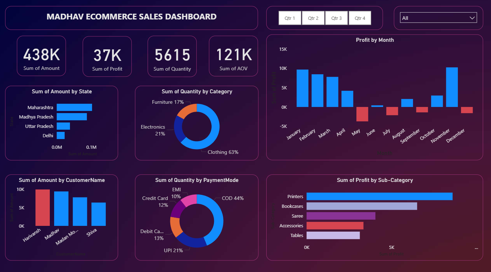

# E-Commerce-Sales-Analysis-Dashboard
🔹 Project Overview

This project is an interactive Power BI dashboard built to analyze e-commerce sales performance across multiple states, categories, and time periods. It provides actionable insights into total sales, profit, quantity sold, and Average Order Value (AOV).

🔹 Key Features

Dashboard & Visuals: Designed and customized 10+ charts (bar, pie, donut, line, map, scatter, clustered charts, slicers) for dynamic analysis.

KPI Scorecards: Tracked 438K+ sales, 37K+ profit, 5615+ orders, and 121K+ AOV using KPIs and scorecards.

Data Modeling: Connected multiple data sources, applied transformations and joins for clean, reliable reporting.

DAX Queries: Created a DAX measure for Average Order Value (AOV) to calculate revenue per order.

Insights: Helped identify top-performing states (e.g., Maharashtra) and underperforming months (e.g., June, July) for business decisions.

🔹 Learnings

Hands-on experience in Power BI dashboard development and data modeling.

Improved skills in data transformation, KPI creation, and DAX queries.

Learned to communicate business insights effectively through visual storytelling.

🔹DashBoard Overview

